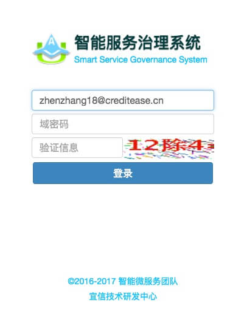
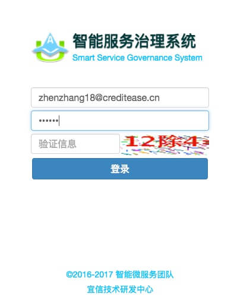
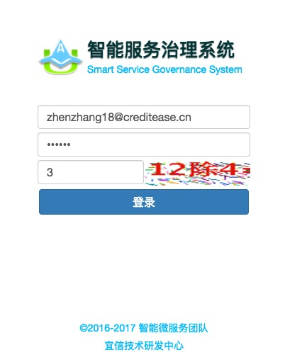
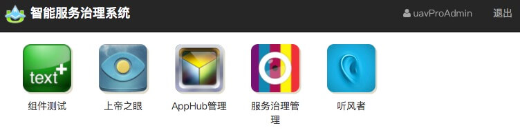
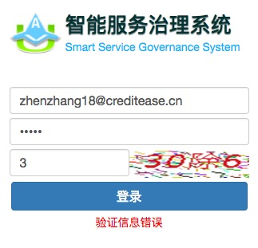
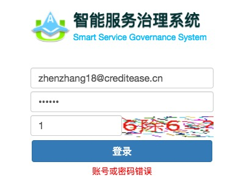

# 登录

### 登录步骤：

#### 1. 输入公司*域账号*（可省略邮箱后缀"@creditease.cn"）

#### 2. 输入域账号密码

#### 3. 输入验证码，验证码为右侧图片的计算结果

#### 4. 点击［登录］按钮

##### *如果登录成功，跳转至[主界面](02_main_page.md)*

##### *如果验证码输入错误会提示：*

##### *如果帐号密码输入错误会提示：*

