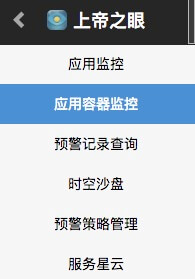
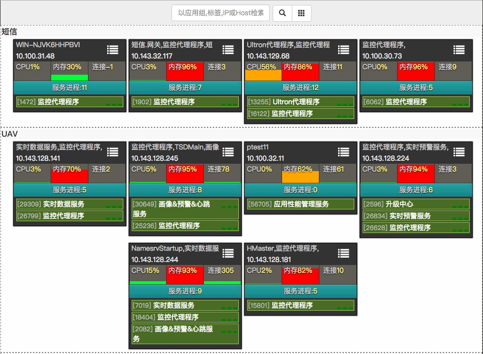
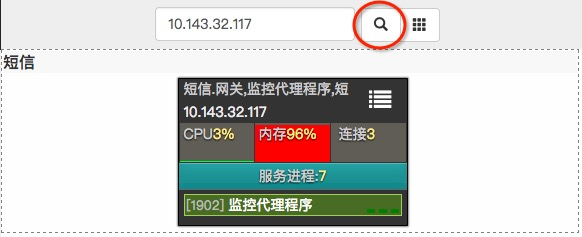

# 应用容器监控

### 上帝之眼中选择应用容器监控

### 概览视图

* 每一个方块表示被监控中的应用容器实例，应用容器可以是物理机或虚拟机
* 虚线框表示应用组。通过设置，属于同应用组的应用容器会被归类在一起（如图中的“短信”、“UAV”）

### 快速检索

* #### 上方搜索框内可以以应用组、标签、IP或Host检索，点击搜索按钮
   
* #### 点击右边按钮，显示全部
  

