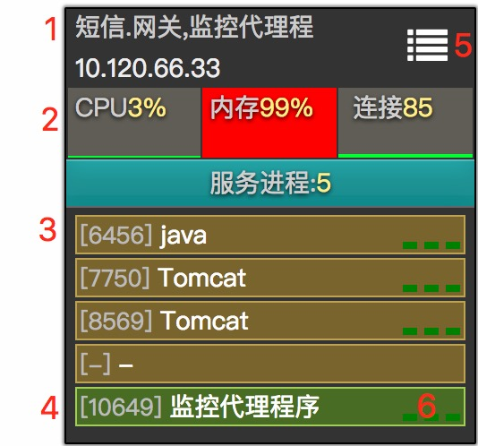
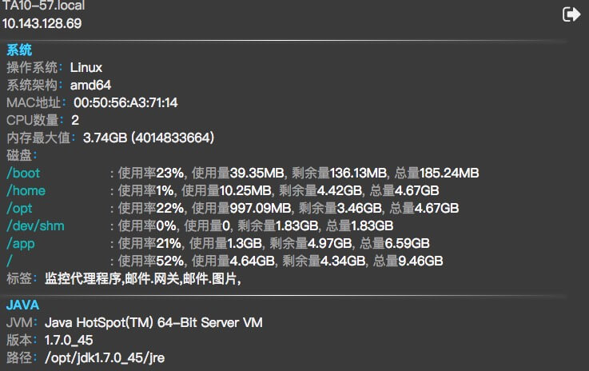
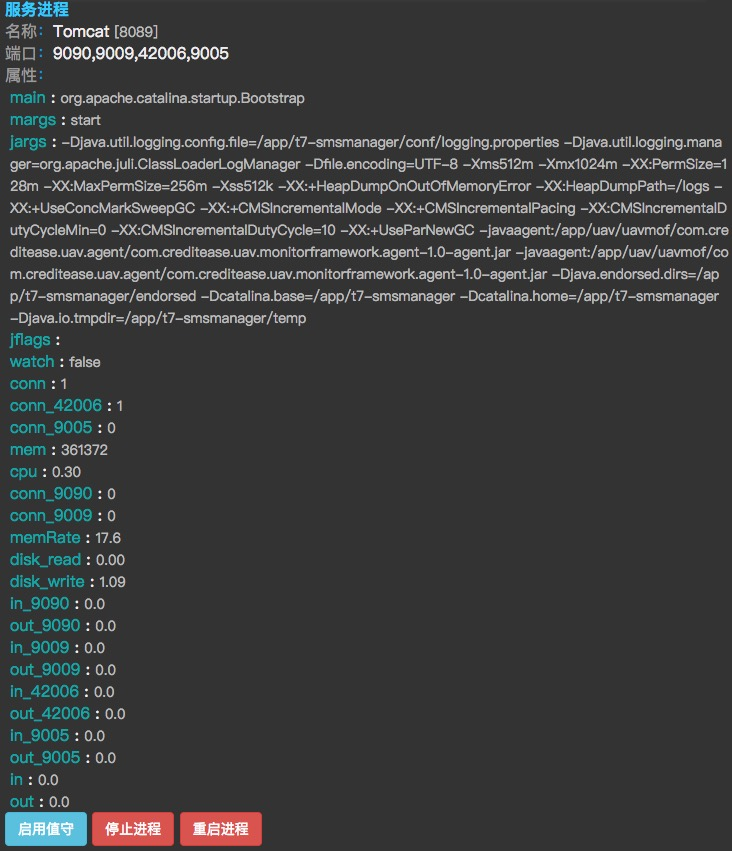
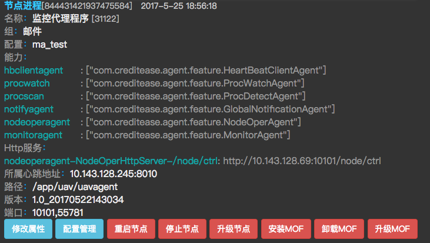

# 应用容器画像

### 监控对象

- #### 操作系统：

  支持Linux和Windows

- #### 进程（服务进程 ＋ Java进程）：

  **服务进程**：任何带有监听端口的进程  
  **Java进程**：以Java启动的程序

### 运行过程

- 自动扫描，周期20秒一次
- 只能扫描到与UAV监控代理程序**同操作系统用户**的进程

### 应用容器实例

1. #### 标签

   说明该应用容器在跑哪些应用程序。无法识别时，显示机器的主机名。

2. #### 系统指标显示

   显示应用容器的CPU使用率、内存使用率（显示数值为服务进程内存使用率）、监听端口总连接数。可点击查看应用容器性能详情。

3. #### 进程指标显示

   []内为**进程ID**，紧跟**应用名称**，可点击查看进程性能详情

   [-] 表示与UAV监控代理程序非同操作系统用户的进程，UAV不对其画像

4. #### UAV 监控代理程序

   UAV的监控代理程序进程。

5. #### 点击查看应用容器详细

6. #### 进程状态示意

   从左到右：CPU、内存、连接数。每项最多显示三格代表：低（绿色）、中（黄色）、高（红色）

### 应用容器详情

* #### 系统信息和JVM信息
  包含主机名、IP地址、操作系统信息、CPU核数、内存大小、磁盘信息、标签、Java信息

  

* #### 服务进程信息
  包含进程名、进程的所有端口、属性、[进程远程控制](11.md)。如果是Java进程，属性中会包含main、margs、jargs、jflags等

  

* #### UAV进程信息
  包含UAV节点信息、[UAV节点远程控制](12.md)

  

  ​