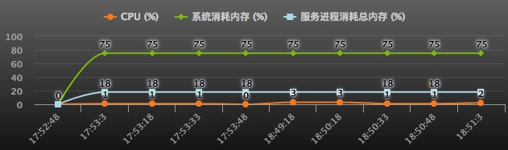
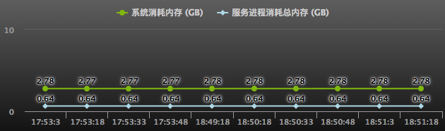
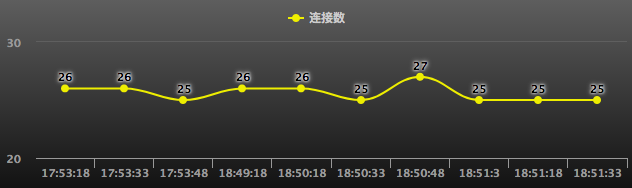
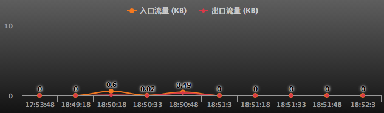
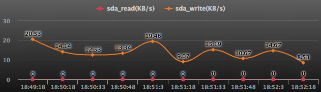

# 应用容器性能

### CPU、系统消耗内存、服务进程消耗总内存

* CPU：CPU使用率
* 系统消耗内存：操作系统消耗的内存占总内存的比率
* 服务进程消耗总内存：服务进程累积使用的内存占总内存的比率

###系统消耗内存、服务进程消耗总内存

### 连接数

* 监听端口的连接数（**ESTABLISHED**状态）

### 监听端口网络入流量、出流量

* 网卡的出口流量、入口流量

### 磁盘IO

* 每个磁盘依次表示为sda、sdb、sdc等
* 显示每个磁盘的读写

