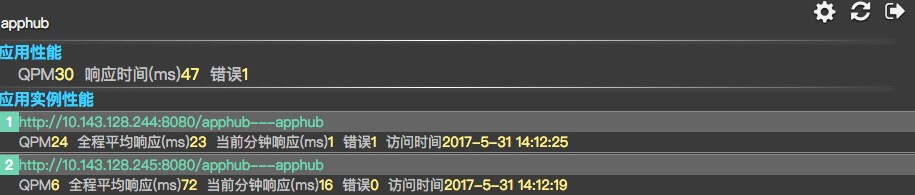
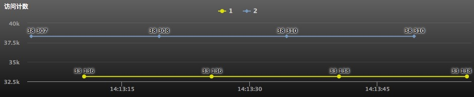
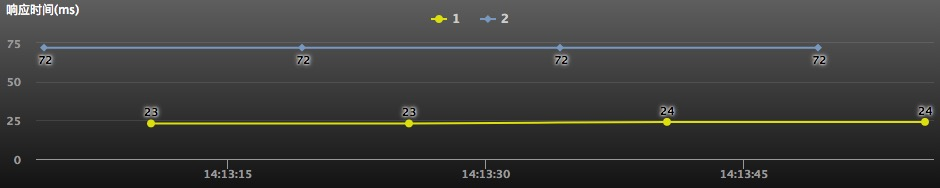
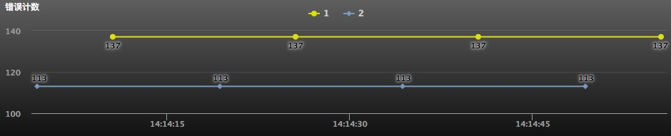

# 应用集群性能

### 应用集群指标
*    #### 应用性能：
     * QPM：每个应用实例的QPM的总和
     * 响应时间: 每个应用实例全程平均响应时间的平均值
     * 错误：每个应用实例错误数的总和
* #### 应用实例性能：
      序号＋[应用ID](04_term.md#应用id)表示每个应用实例，分别列出每个应用实例的QPM、响应时间、错误、访问时间
      * QPM：每分钟吞吐量
      * 全程平均响应时间：从应用启动开始计算的累积平均响应时间
      * 当前分钟响应时间：最近1分钟内的响应时间
      * 错误：最近1分钟内的错误数(Http响应码4XX、5XX)
      * 访问时间：最近一次的访问时间

### 访问计数

按序号分别列出每个应用的累计访问计数

### 响应时间

按序号分别列出每个应用的全程平均响应时间

### 错误计数

按序号分别列出每个应用的累计错误计数

