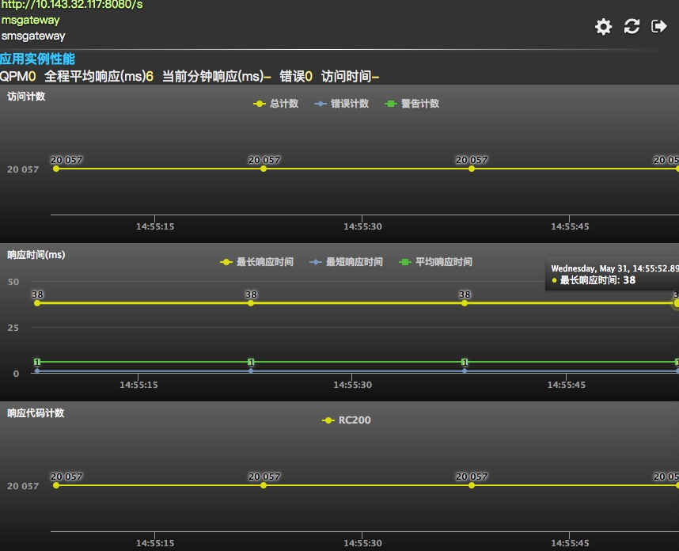
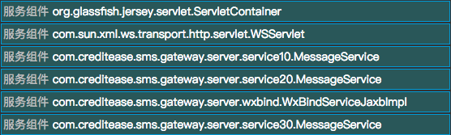

# 应用实例性能

### 应用实例性能
* #### 应用实例指标

  * **访问计数**：总计数、错误计数、警告计数
  * **响应时间**：最长相应时间、最短相应时间、平均响应时间
  * **响应代码计数**：RC＋HTTP响应码，如**RC200**表示HTTP响应码是200

### 应用实例组件

* #### [调用链跟踪](91.md)

  

* #### [线程分析](92.md)

 
 
* #### [应用服务器／JVM](19.md)

  
  
* #### [日志组件](22.md)

  

* #### [服务组件](20.md)

  

* #### [客户端组件](21.md)

  

  
