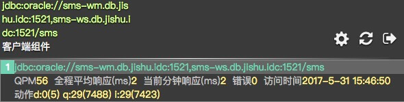
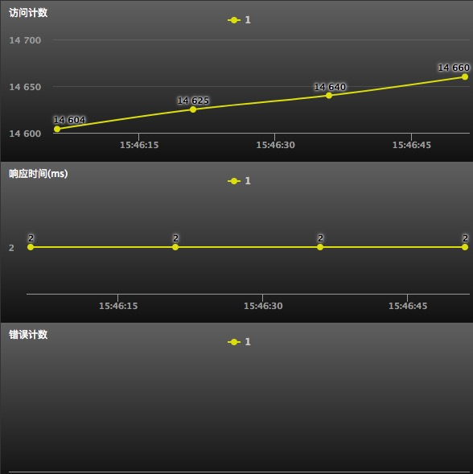

# 客户端组件性能

### 客户端组件的每个Target URL指标
* 包含客户端组件的QPM、全程平均响应、当前分钟响应、错误、访问时间
* **动作**：客户端的操作计数，（）内为累积计数。如jdbc有： i（增加）、d（删除）、u（修改）、q（查询）、b（批量执行）等动作

  ​

### 客户端组件每个Target URL指标原始数据图表

* #### 包含指标：

  * 访问计数
  * 响应时间
  * 错误计数

