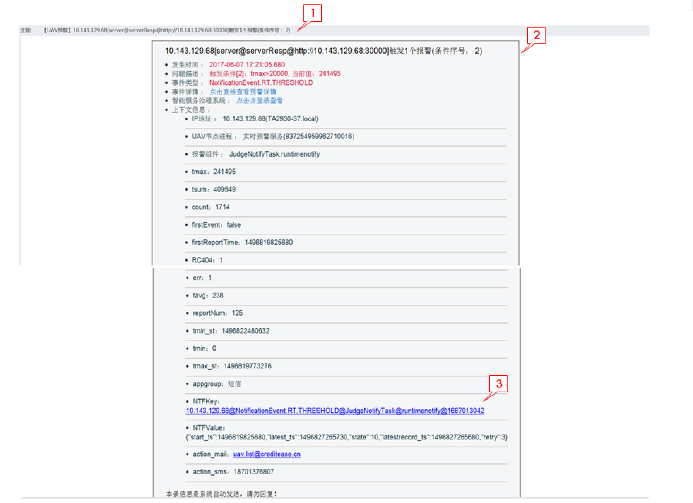

# 报警接收

报警可通过邮件、短信、HTTP接口三种方式接收。
###邮件{#邮件}

#####1.邮件主题
包含预警的摘要信息。
#####2.邮件正文
包含预警的详细信息，同[报警详情](41.md)。
#####3.预警链接
点击可进入[报警详情](41.md)页面。
###短信{#短信}

* #### 短信内容：

> &lt;UAV预警&gt; ${time} ，发生 ${title} 事件。登录邮箱查看详情。

* **time**： 预警事件发生的时间
* **title**：预警的摘要信息，与邮件主题相同

###HTTP接口{#HTTP接口}

发送HTTP请求预警到配置的URL

* method： POST
* content-type： application/json
* encoding： utf-8
* body：预警事件


* #### 预警事件JSON example：
```
{
  "createtime": 1497602705129,
  "time": 1497602705070,
  "title": "10.143.128.245[server@serverResp@http://10.143.128.245:10101]触发1个报警(条件序号： 1)",
  "host": "TA70-35.local",
  "_id": {
    "timestamp": 1497602705,
    "time": 1497602705000,
    "machineIdentifier": 6375121,
    "processIdentifier": 5138,
    "counter": 13251776,
    "timeSecond": 1497602705,
    "date": 1497602705000
  },
  "description": "触发条件[1]：120秒内tavg的avg值>7000, 当前值：12316.0\n\r",
  "args": {
    "tmax": "12316",
    "tsum": "12316",
    "count": "1",
    "firstReportTime": "1497600725070",
    "nodeuuid": "837254959962710016",
    "action_mail": "uav.list@creditease.cn",
    "component": "JudgeNotifyTask",
    "RC200": "1",
    "tavg": "12316",
    "action_sms": "18701376807",
    "nodename": "实时预警服务",
    "feature": "runtimenotify",
    "reportNum": "34",
    "tmin_st": "1497600657436",
    "tmin": "12316",
    "tmax_st": "1497600657436",
    "appgroup": "UAV"
  },
  "ntfkey": "10.143.128.245@NotificationEvent.RT.THRESHOLD@JudgeNotifyTask@runtimenotify@-1344647425",
  "firstrecord": "false",
  "eventid": "NotificationEvent.RT.THRESHOLD",
  "appgroup": "UAV",
  "ip": "10.143.128.245"
}
```
