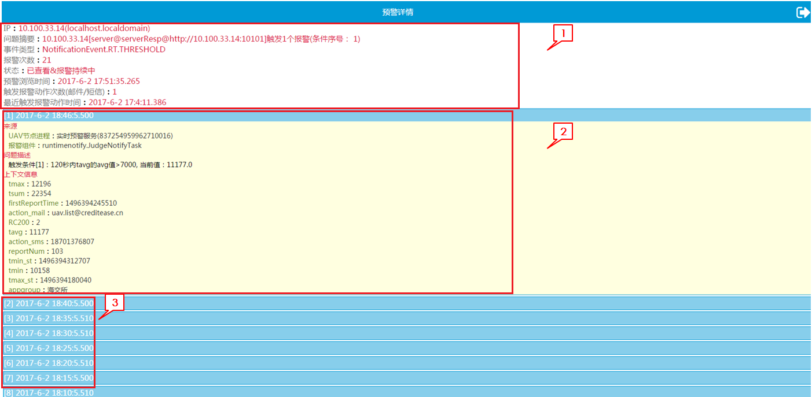

# 报警详情
点击列表视图中预警概览栏进入预警详情页面

#####1.预警概要信息
显示预警信息，及预警触发次数、报警动作次数与时间。
**注：**
* 触发动作只会执行3次，每次间隔30分钟（避免邮件，短信轰炸）
* 4小时后（给予人类修复问题的时间）。如果记录状态是新预警，则会不断追加预警事件到该记录项；如果记录状态是已查看，则会创建新纪录

#####2.预警详细信息
包括预警来源、问题描述、上下文信息。
#####3.历史预警
相同预警的重复预警记录，点击可打开预警详细信息。