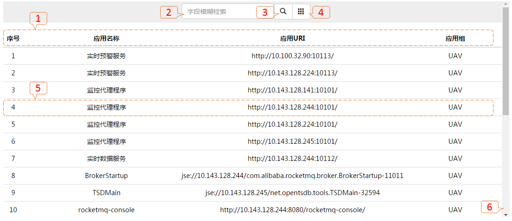
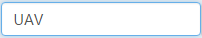
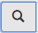
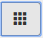

# 应用实例列表视图

---

### 列表视图：

* 【1】：列表字段：*序号（显示顺序编号）、应用名称（应用实例名称）、应用URI（应用实例访问URI）、应用组（UAV分组）*；
* 【2】：检索内容输入框：*列表字段内容模糊匹配*；
* 【3】：检索内容查询按钮；
* 【4】：全数据查询按钮；
* 【5】：点击行任意位置进入[查看历史数据](45.md)；
* 【6】：滚动滚动轴置最底部，触发追加下一页数据。

---

### 检索：
* 检索内容查询：检索内容查询输入框*输入“UAV”*，点击检索内容查询按钮。
* 全数据查询：点击查询全数据按钮。

---
