# 查看历史数据

---
### 应用实例详情视图：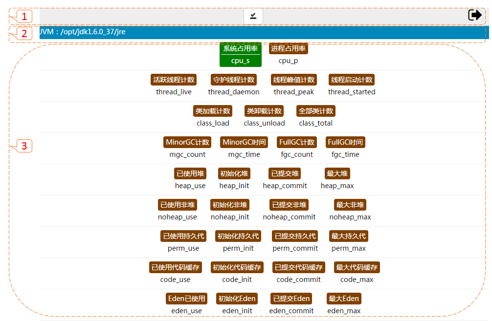

* 【1】：头部，点击返回到[应用实例列表视图](43.md)；
* 【2】：应用实例内容：JEE（应用实例、应用服务器、服务组件、客户端组件）， JSE（JVM）；
* 【3】：实例内容对应可选指标。

---

### JEE 应用实例：

---

### JEE 应用服务器：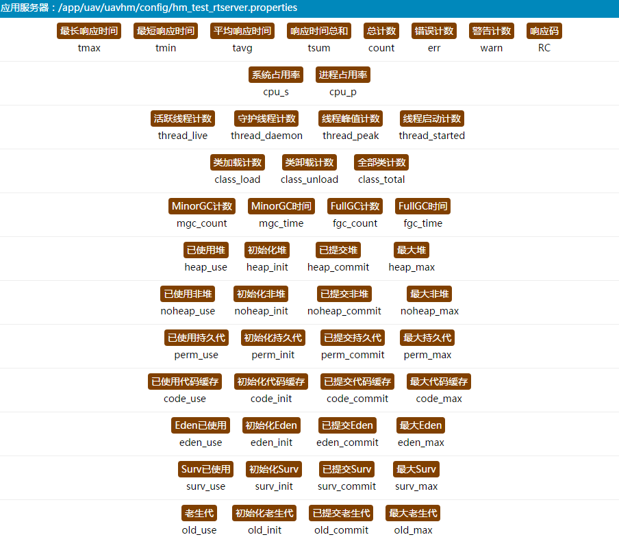

---

### JEE 服务组件：
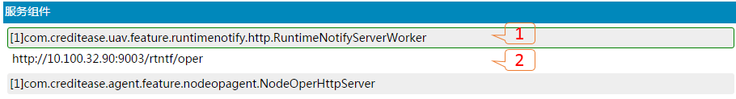

* 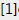服务组件包含的服务数量

* 点击服务组件【1】，显示服务组件包含的服务【2】。

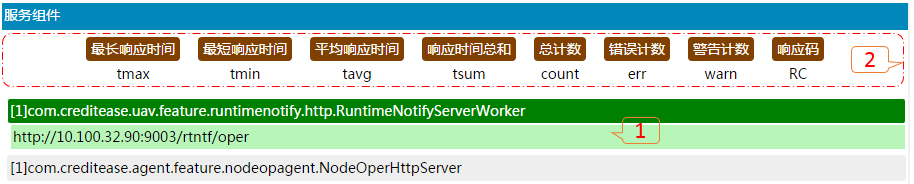

* 点击服务组件的服务【1】，显示可选指标【2】。

---

### JEE 客户端组件：
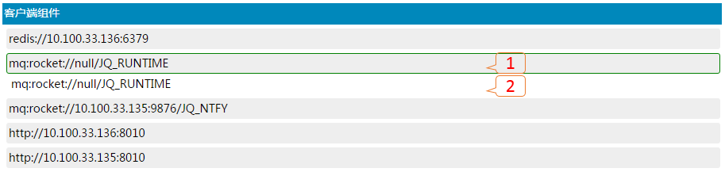

* 点击客户端组件【1】，显示客户端组件包含的服务【2】。

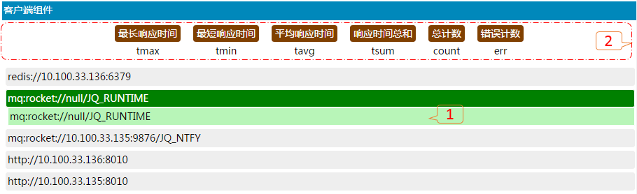

* 点击客户端组件的服务【1】，显示可选指标【2】。

---

### JSE JVM：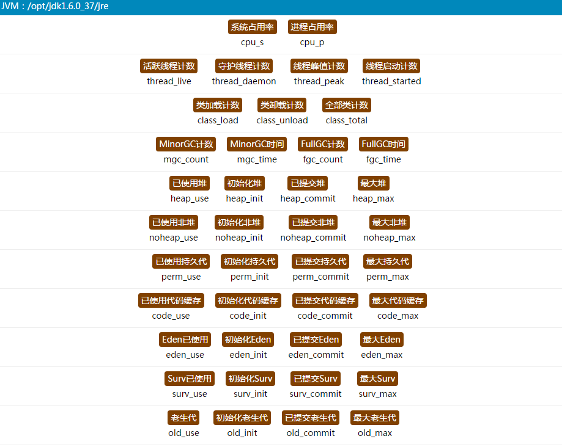

---

### 指标选择

* 上面为指标中文译意，下面为指标英文缩写。

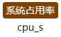

* 未选中指标。

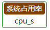

* 鼠标滑过指标。

* 选中指标。

---

##### 确认

* 选择完指标点击确认图标。

---

##### 选择查询粒度

* 渲染粒度：按（日\时\分）为单位进行渲染。
* 粒度具有范围属性（默认值，用户无须操作），如粒度范围600，按分进行渲染跨度为10小时。

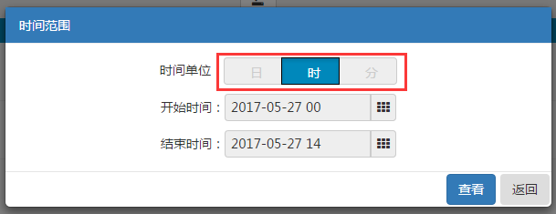

---

##### 选择查询历史时间

* 开始时间不能早于结束时间，结束时间不能超过当前时间。

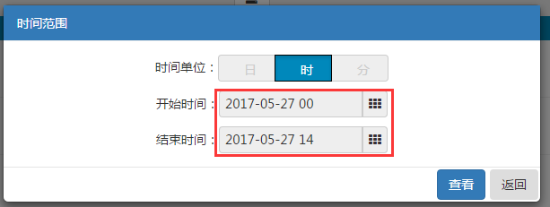

* 点击进行时间选择。

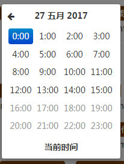

* 时间选择，会依据粒度自动格式化。

---

#####5、查看

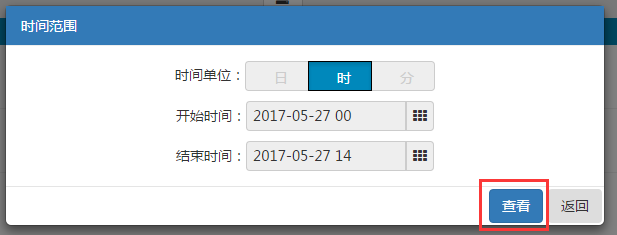

* 点击查看进行历史数据查看，点击取消返回到《应用实例详情视图》。

---

##### 历史数据查看
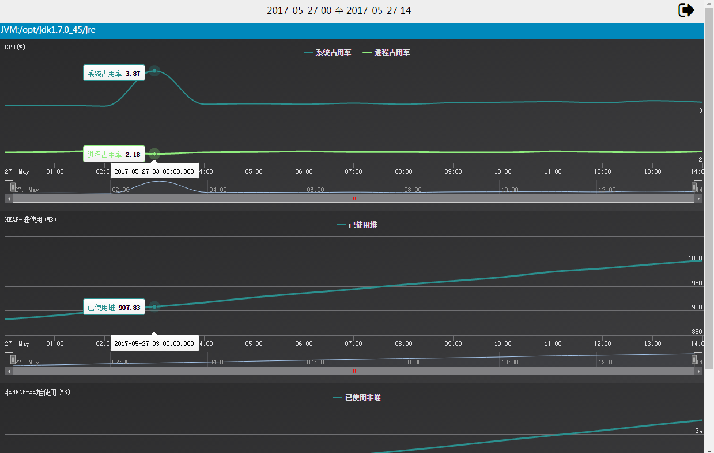

* 点击返回到《选择查询粒度》。

---

##### 无历史数据
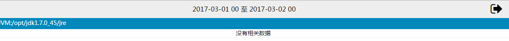

---

##### 历史数据查看（隐藏指标）
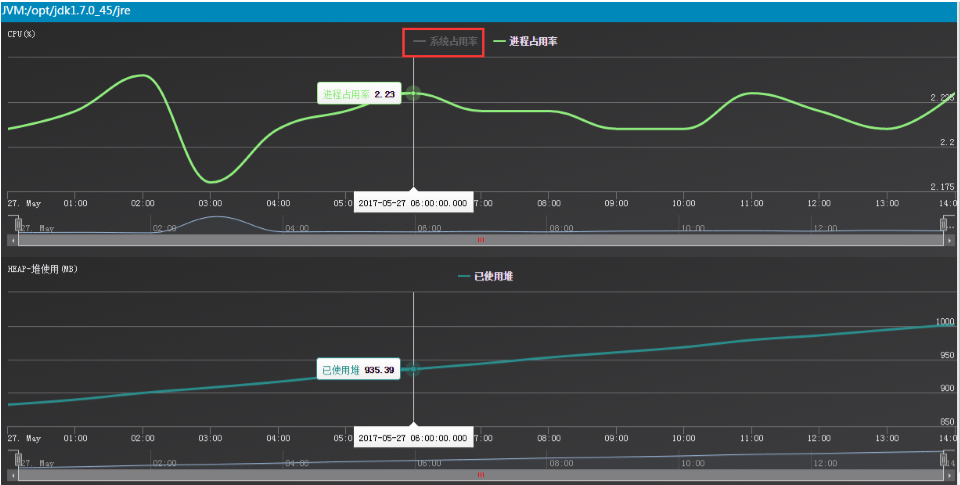

---

##### 历史数据查看（选取时间段）
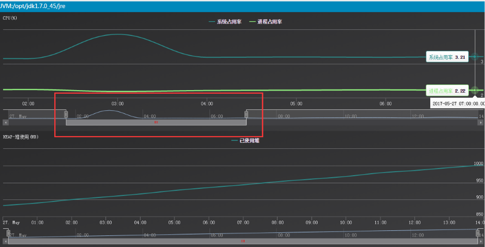

---
