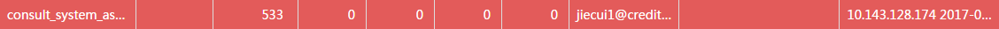
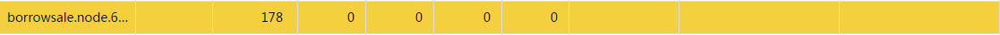

# 应用：听风者

**听风者**是线上RabbitMQ队列的监控，包括[实时数据查看](47.md)与[历史数据查询](48.md)两个功能。听风者的使用对象包括但不限于：

* SIA项目组
* 使用SIA客户端的各项目组

用户使用**域账号**[登录](01_login.md)之后，在首页就能发现听风者。 
 

### 1.术语解释

* **队列名称**：RabbitMQ服务器上的队列名

* **项目名称**：SIA5.0.1版本中，用户配置的 _PROJECT\_NAME_

* **累积条数**：当前队列未消费的消息条数

* **增长次数**：累积条数持续增长的次数

* **发送条数**：之前一分钟内发往队列的消息条数

* **接收条数**：之前一分钟内从队列消费的消息条数

* **消费者数**：从队列接收消息的消费者个数

* **报警Email**：接收预警邮件的邮箱名，SIA5.0.1版本中，用户配置的 _EMAIL\_RECEVIERS_

* **接收IP及时间**：从队列消费消息的机器IP及其最近的消费时间

* **发送IP及时间**：向队列发送消息的机器IP及其最近的发送时间

* **队列总数**：RabbitMQ服务器上的队列名总数

* **发送总数**：之前一分钟发往各队列的消息条数总和

* **接收总数**：之前一分钟从各队列消费的消息条数总和

### 2.队列状态解释

队列健康状态按颜色分为五类：
  
* **红色**：预警状态，累积条数或增长次数超过用户设定的阈值（累积条数默认阈值为100条，增长次数默认阈值为5次）。此时已发送预警邮件。 
 
  

* **黄色**：警告状态，消费者数为零，累积条数大于零。说明有未消费的消息。 
 
  

* **灰色**：弃用状态，消费者数为零，累积条数也为零。说明队列没有消息流通，可能已废弃。
  
  

* **白色**：空闲状态，消费者数大于零，发送条数与接收条数都为零。说明队列暂无消息流通。  

  

* **绿色**：运行状态，消费者数大于零，发送条数与接收条数也都大于零。说明队列有消息流通，收发两端正常通信。
  

