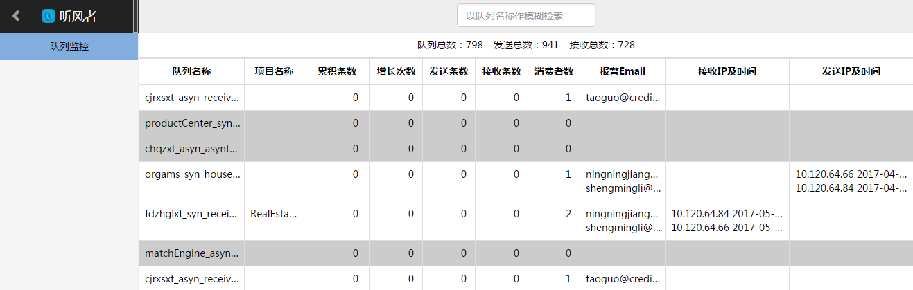
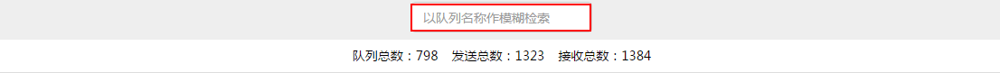
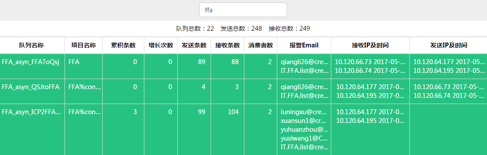
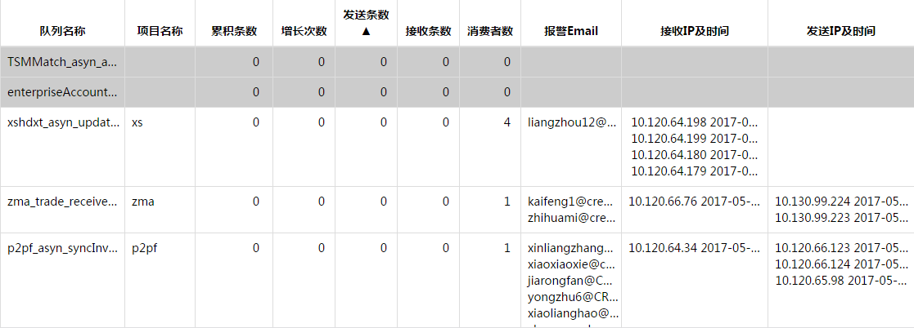
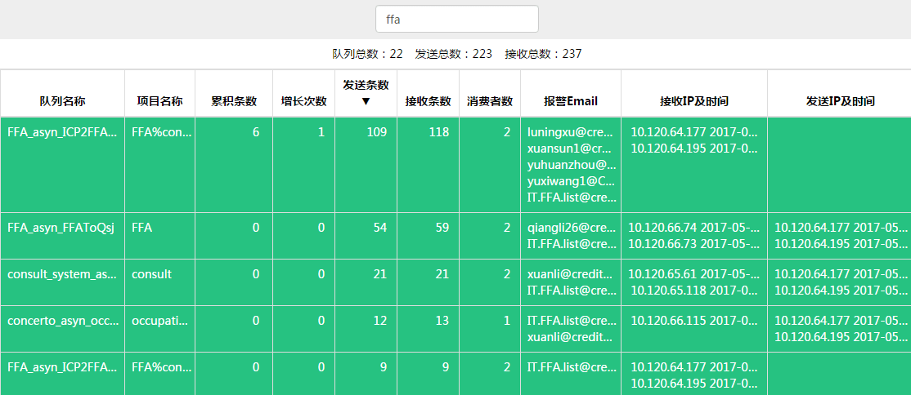

#实时数据查看 {#runtime_data}

用户点击听风者，进入听风者页面。然后点击左侧**队列监控**，即出现实时数据展示页面。实时数据查看包括[检索功能](#search)与[排序功能](#sort) 。 

### 1.检索功能{#search}
在听风者应用的最上方，有一个检索框：

以队列名称做模糊检索，就能查看相应的队列：

### 2.排序功能{#sort}

听风者对**队列名称**、**累积条数**、**增长次数**、**发送条数**、**接收条数**、**消费者数**等列提供排序功能。

 * 以**发送条数**为例，点击**发送条数**，出现**发送条数▲**，表示按照升序排序：
 

* 再次点击**发送条数**，出现**发送条数▼**，表示按照降序排序：

### 3.[检索功能](#search)与[排序功能](#sort)可以搭配使用

###4.点击**队列名称**这一列下的任意队列，即进入相应队列的[历史数据查询](48.md)界面

