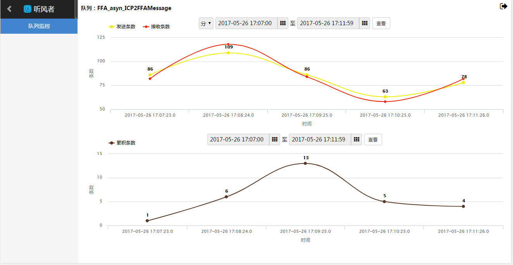
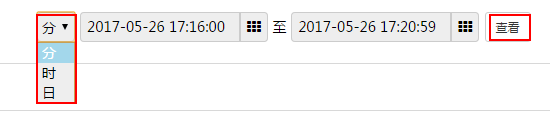
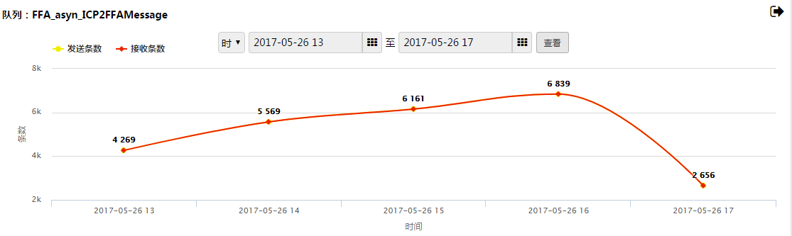
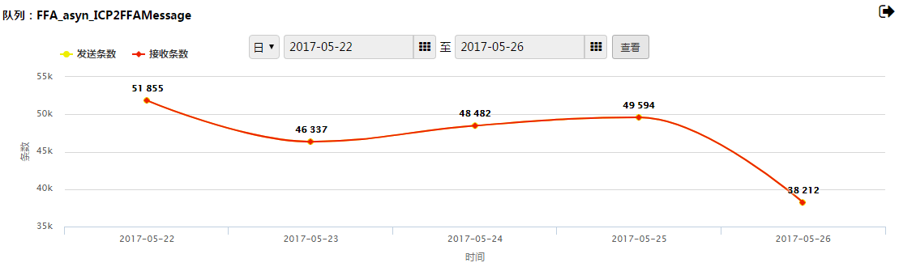
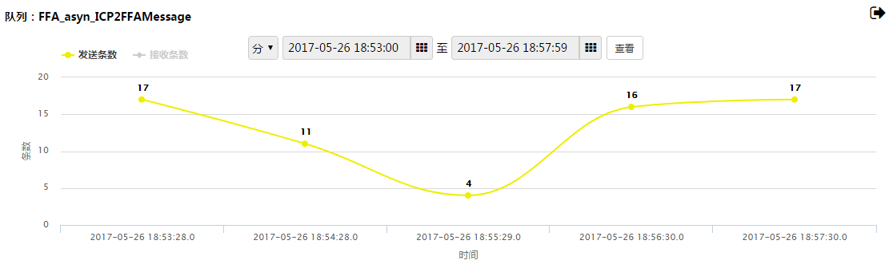
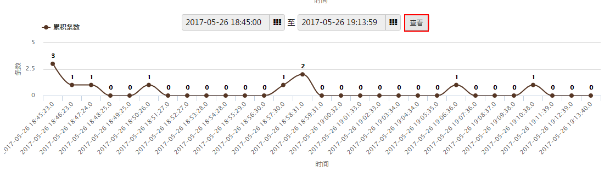
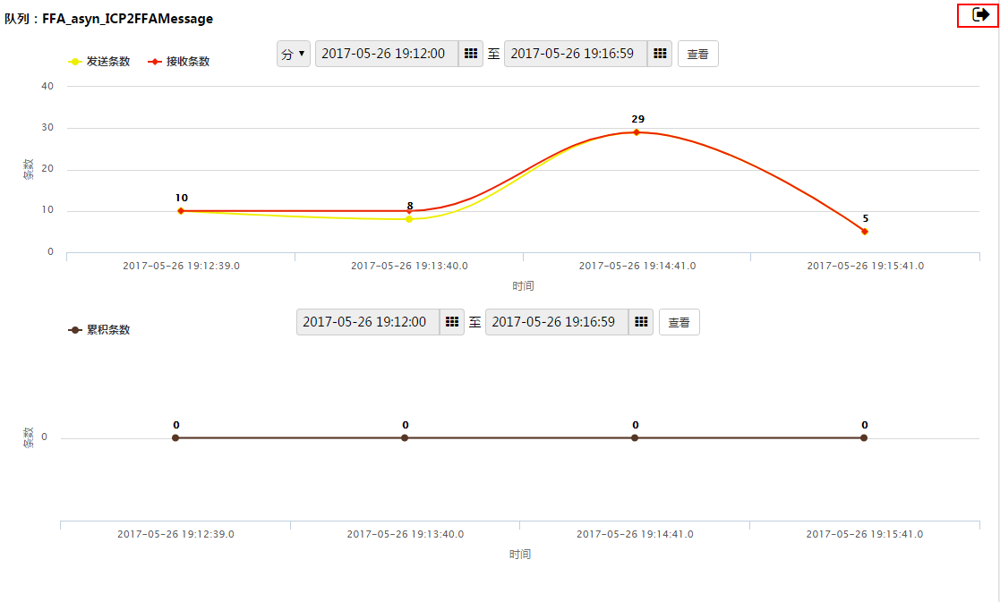

#历史数据查询 {#history_data}

点击**队列名称**这一列下的任意队列，即进入相应队列的历史数据展示界面。

###1.发送条数与接收条数展示图

按照时间单位，可以展示最近七天的历史数据。选择时间单位，设置起始时间与结束时间，点击**查看**：

* **分**，查看区间为30分钟

* **时**，查看区间为30小时

*(发送条数与接收条数重合了)*

* **日**，查看区间为7天

*(发送条数与接收条数重合了)*

如果只想看发送条数（或接收条数），则点击**发送条数**（或**接收条数**）进行**开启**或**关闭**。

###2.累积条数展示图
按照时间单位，可以展示最近七天的历史数据。查看区间为30分钟。

累积条数不为零说明当时发送条数总数大于接收条数总数。

###3.点击**返回**图标，即可回到上一层[实时数据查看](47.md)界面。

