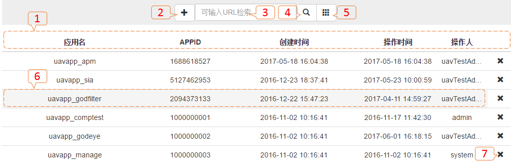
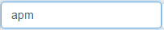
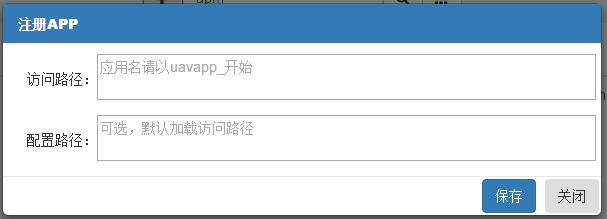
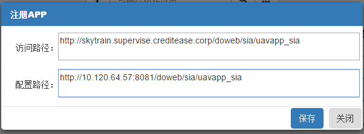
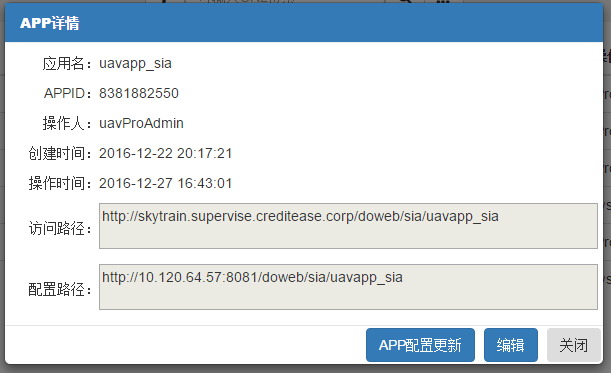
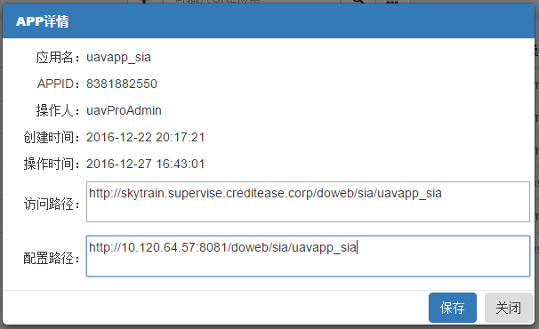
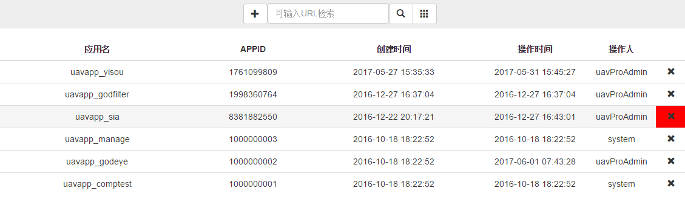
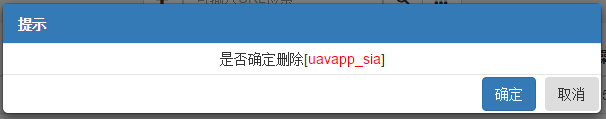

# 应用：AppHub管理

###APP管理

* 管理APPHUB主页面APP注册、修改、删除。

---

### 列表视图：

* 【1】：列表字段：*应用名（APP应用英文名字）、APPID（APP应用唯一ID）、创建时间（数据创建时间，此值不会改变）、操作时间（创建和修改会更新此值）、操作人（创建和修改的登录用户）、X（删除按钮）*；
* 【2】：注册APP按钮；
* 【3】：检索内容输入框：*列表字段内容模糊匹配*；
* 【4】：检索查询按钮；
* 【5】：全数据查询按钮；
* 【6】：点击行任意位置（除去删除按钮【7】）进入[修改](49.md#修改);
* 【7】：删除APP配置信息。

---

### 检索：
* 检索查询：在检索内容输入框，输入检索内容
  ，点击检索查询按钮。

* 全数据查询：点击查询全数据按钮。

---

### 注册：

* 点击注册APP按钮。

* 【访问路径】：*UAV APPHUB配置文件下载的WEB URL如：http://skytrain.supervise.creditease.corp/doweb/sia/uavapp_sia*
* 【配置路径】：*如网部署隔离等原因，【访问路径】读取失败，可配置此路径，程序将优先从配置路径下载，如：http://10.120.64.57:8081/doweb/sia/uavapp_sia*；

* 【保存】：*下载配置，保存注册配置*；
* 【关闭】：*返回到[列表视图](49.md#列表视图)*。

---

### 修改：

* 【访问路径】【配置路径】：*默认只读*；
* 【APP配置更新】：*重新读取路径下的配置保存到缓存*；
* 【编辑】：*点击进行编辑，【访问路径】【配置路径】切换为修改状态、【编辑】按钮切换为【保存】按钮*；
* 【关闭】：*返回到[列表视图](49.md#列表视图)*。

  

* 【保存】：*下载配置，保存修改配置*；
* 【关闭】：*返回到[列表视图](49.md#列表视图)*。

---

### 删除：

* 鼠标滑动到需要删除的行，点击，弹出删除提示。

* 【确定】：*删除APP配置信息*;
* 【取消】：*返回到[列表视图](49.md#列表视图)*。

---
