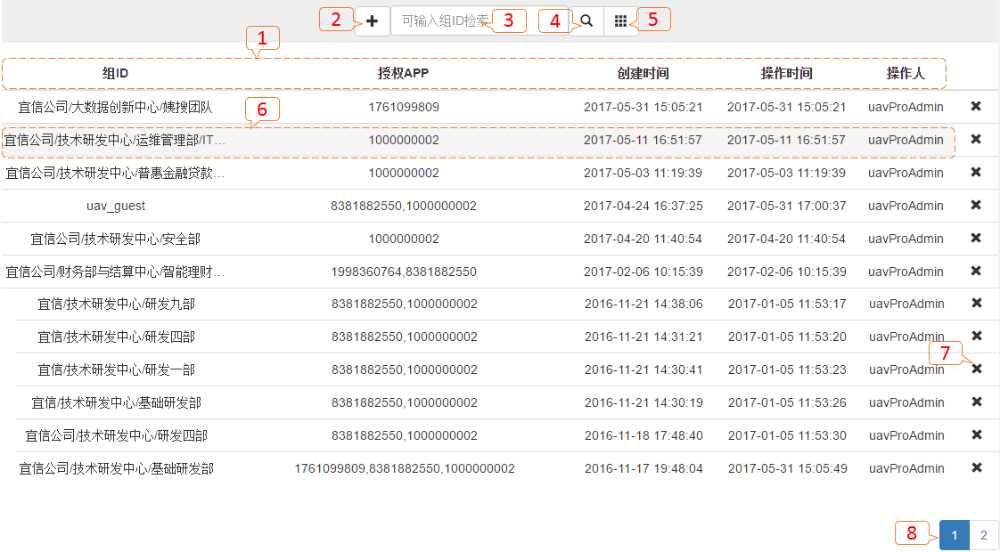
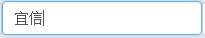
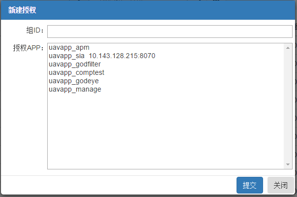
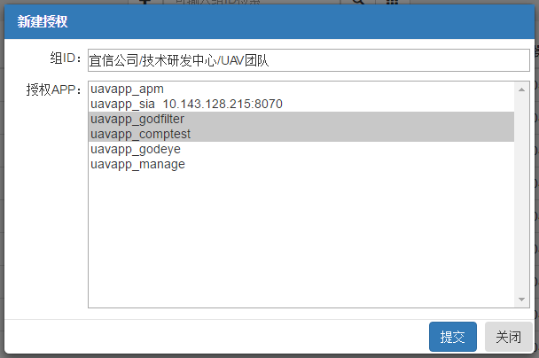
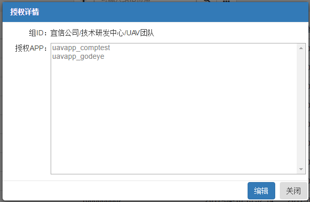
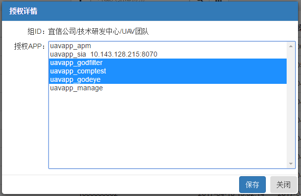
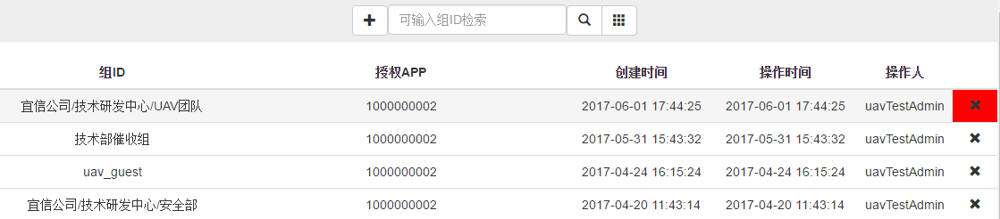
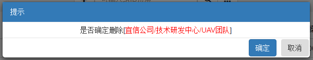

# 授权管理

###授权管理

* 管理APPHUB主页面APP授权。

---

### 列表视图：

* 【1】：列表字段：*组ID（LDAP登录用户归属组织机构）、授权APP（APP应用唯一ID）、创建时间（数据创建时间，此值不会改变）、操作时间（创建和修改会更新此值）、操作人（创建和修改的登录用户）、X（删除按钮）*；
* 【2】：新建授权按钮；
* 【3】：检索内容输入框：组ID内容模糊匹配；
* 【4】：检索查询按钮；
* 【5】：全数据查询按钮；
* 【6】：点击行任意位置（除去删除按钮【7】）进入[修改](#修改)；
* 【7】：删除授权信息；
* 【8】：分页按钮。

---

### 检索：

* 检索查询：在检索内容输入框，输入检索内容
  ，点击检索查询按钮。
* 全数据查询：点击查询全数据按钮。

---

### 创建：

* 点击新建授权按钮。

* 组ID：*填写LDAP用户组织架构*；
* 授权APP：*默认为没有授权，此处显示APP注册信息*；
* 关闭：*返回[列表视图](#列表视图)*。

* 【组ID】：*输入LDAP用户组织架构*；
* 【授权APP】：*选择授权APP，可按住shift进行多选*；
* 【提交】：*保存授权信息*；
* 【关闭】：*返回[列表视图](#列表视图)*。

---

### 修改：

* 【组ID】：*不可修改*；
* 【授权APP】：*默认只读*；
* 【编辑】：*点击进行编辑、【授权APP】切换为可修改状态、【编辑】按钮切换为【保存】按钮*；
* 【关闭】：*返回[列表视图](#列表视图)*。

* 【授权APP】：*选择授权APP，可按住shift进行多选*；
* 【保存】：*保存授权信息*；
* 【关闭】：*返回[列表视图](#列表视图)*。

---

### 删除：

* 鼠标滑动到需要删除的行，点击，弹出删除提示。

* 【确定】：*删除授权信息*;
* 【取消】：*返回到[列表视图](#列表视图)*。

---
