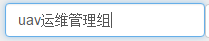
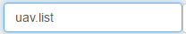
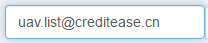
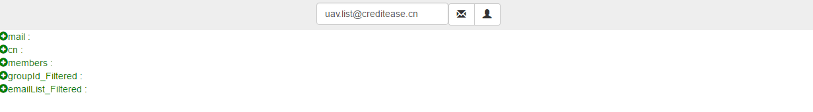
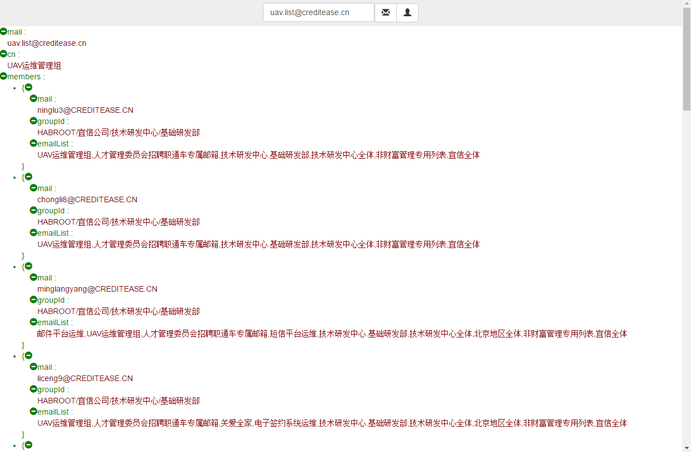

# 邮箱查询

* 在查询邮箱内容输入框，输入查询内容（精确查询）。
* 支持中文查询

* 支持英文查询（不区分大小写），不带后缀

* 支持英文查询（不区分大小写），带后缀

* 点击LDAP组邮箱查询按钮

* 【email】:*组邮箱英文全名*;
* 【cn】：*组邮箱中文全名*
* 【members】：*组邮箱包含用户信息*
* 【members-mail】:*组邮箱包含用户信息-用户邮箱英文全名*
* 【members-groupid】:*组邮箱包含用户信息-用户归属组织架构*
* 【members-emailList】:*组邮箱包含用户信息-用户归属邮箱组列表*
* 【groupId_Filtered】:*组邮箱包含用户信息-用户归属组织架构-聚集后结果*
* 【emailList_Filtered】:*组邮箱包含用户信息-用户归属邮箱组列表-聚集后结果*

---

