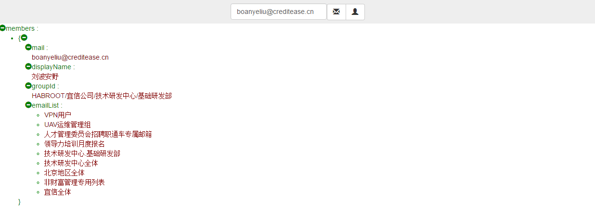

# 人名查询

* 在查询邮箱内容输入框，输入查询内容（精确查询）。
* 支持英文查询（不区分大小写），不带后缀

* 支持英文查询（不区分大小写），带后缀

* 点击LDA用户邮箱查询按钮

* 【email】:*用户邮箱英文全名*;
* 【displayName】：*用户邮箱中文全名*
* 【groupId】:*用户归属组织架构*
* 【emailList】:*用户归属邮箱组列表*

---

