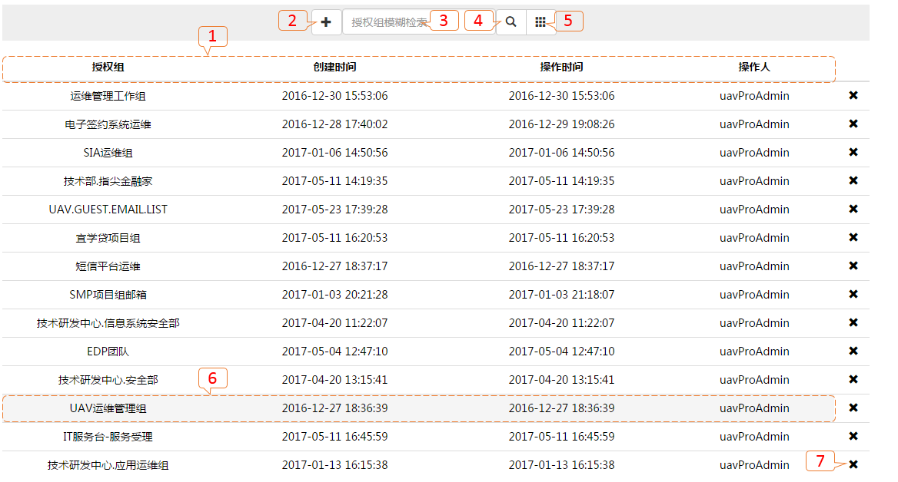
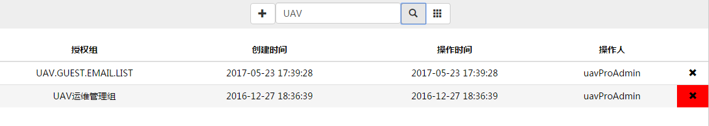
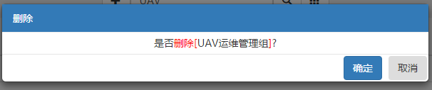

# 应用：服务治理管理

### 监控授权

* 对APPHUB上帝之眼数据和操作授权

---

### 列表视图

1. 列表字段：_授权组（邮箱组中文名）、创建时间（数据创建时间，此值不会改变）、操作时间（创建和修改会更新此值）、操作人（创建和修改的登录用户）、X（删除按钮）_
2. 新建按钮
3. 检索内容输入框：_授权组字段内容模糊匹配_
4. 检索查询按钮
5. 全数据查询按钮
6. 点击行任意位置（除去删除按钮【7】）进入[修改](#修改)
7. 删除信息

---

### 检索

* 检索查询：在检索内容输入框，输入检索内容
  ，点击检索查询按钮。
* 全数据查询：点击查询全数据按钮。

---

### 创建

* 点击新按钮。

* **授权组名称**：_邮箱组中文全名_
* **GROUP映射**：_UAV分组列表_
* **关闭**：_返回_[_列表视图_](#列表视图)

* **授权组名称**：_输入邮箱组中文全名_
* **GROUP映射**：_勾选授权UAV分组可视权限_
* **提交**：_保存新建信息_
* **关闭**：_返回_[_列表视图_](#列表视图)

* **授权设置**：_点击【授权设置】、将显示【GROUP授权】_
* **GROUP授权**：_勾选授权控制权限_
* **提交**：_保存新建信息_
* **关闭**：_返回_[_列表视图_](#列表视图)

---

### 修改

* 信息json格式显示
* **编辑**：_点击进行编辑，【编辑】按钮切换为【保存】按钮_
* **关闭**：_返回_[_列表视图_](#列表视图)

* **授权组名称**：_不可修改_
* **GROUP映射**：_勾选授权UAV分组可视权限_
* **保存**：_保存修改信息_
* **关闭**：_返回_[_列表视图_](#列表视图)

* **授权设置**：_点击【授权设置】、将显示【GROUP授权】_
* **GROUP授权**：_勾选授权控制权限_
* **保存**：_保存修改信息_
* **关闭**：_返回_[_列表视图_](#列表视图)

---

### 删除

* 鼠标滑动到需要删除的行，点击，弹出删除提示。

* **确定**：_删除授权信息_
* **取消**：_返回到_[_列表视图_](#列表视图)

---

