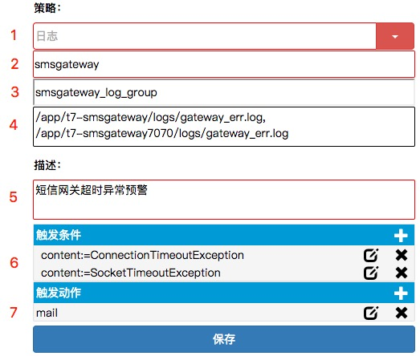

# 日志

在[预警策略设置](28.md)时，若设置日志相关策略，填写示例如下：
1. 应用ID，则输入应用名或war包名
2. 指定日志，则指定日志全路径文件名
3. 触发条件，则触发表达式为 
    * content:=XXX，表示日志包含XXX内容
    * content!=XXX，表示日志不包含XXX内容

* #### 示例：网络超时预警

此示例为短信网关针对运营商网络超时设置的预警策略

1. 预警策略为日志
2. 此日志策略适用对象是应用名为 *smsgateway* 的应用
3. 如果是对多个日志文件预警，此项应填写一个组名字
4. 指定应用中 */app/t7-smsgateway/logs/gateway_err.log* 和 */app/t7-smsgateway7070/logs/gateway_err.log* 这两个日志文件
5. 预警描述，供查询检索
6. 预警触发条件为日志内容包含 *ConnectionTimeoutException* 或 *SocketTimeoutException* 字段，这两个异常可以反应在建立连接或者读数据时发生超时
7. 预警触发后通过邮件预警，预警邮件发送给短信运维组

